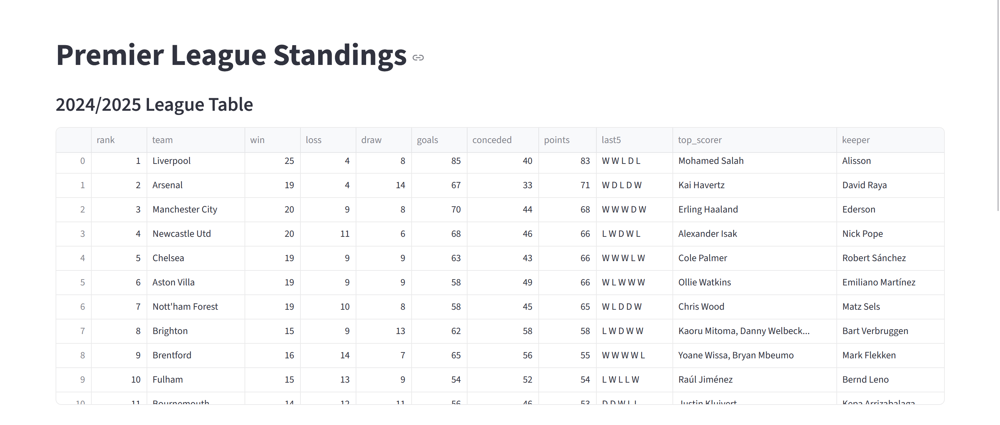
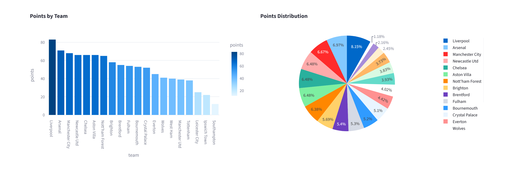
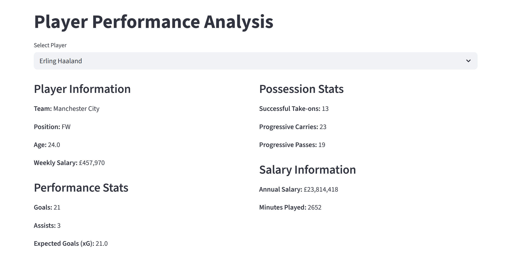
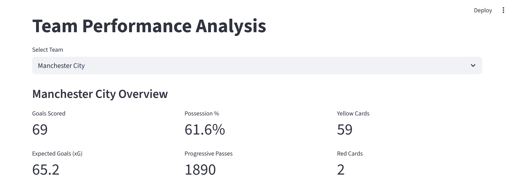
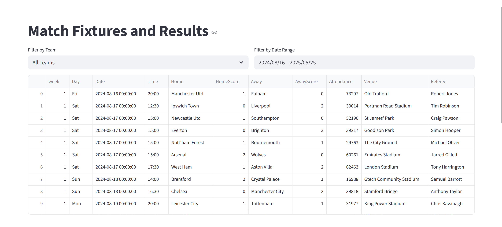

#  Premier League Analysis


An interactive web dashboard for analyzing Premier League football statistics with visualizations and insights.

##  Scrrenshot

##  Final rank 


##  Team poin


## Player status


## Team status


## Match information


##  Features

- **Real-time League Standings** with interactive charts
- **Team Performance Metrics**: Goals, possession, xG, and more
- **Player Statistics**: Goals, assists, salaries, and possession data
- **Match Fixtures** with filtering capabilities
- **Interactive Visualizations** using Plotly

##  Quick Start

1. Clone the repository:
```bash
git clone https://github.com/yourusername/football.git
cd football
